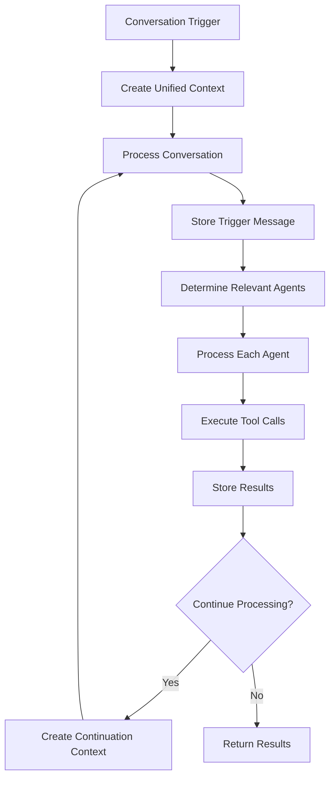

# Unified Conversation Processor Refactor

## Overview

This document explains the major refactor that unified all conversation management logic into a single, generalized `UnifiedConversationProcessor`. This refactor eliminates duplicate code, simplifies the architecture, and makes the system more maintainable.

## Problem Statement

### Before Refactor: Fragmented Logic

The original architecture had **multiple separate methods** handling different conversation scenarios:

```typescript
// ❌ OLD: Multiple specialized methods
class ConversationEngine {
  processMessage()           // User messages to tasks
  processAgentResponse()     // Agent responses + recursion
  handleThreadMessage()      // Thread-specific logic
  handleThreadCreation()     // Thread creation
  executeAgentToolCall()     // Tool execution
  shouldContinueProcessing() // Continuation decisions
  buildToolResultsMessage()  // Message formatting
  // ... more specialized methods
}
```

### Issues with Old Architecture

1. **Code Duplication**: Similar logic repeated across methods
2. **Inconsistent Recursion**: Only `processAgentResponse` had recursive logic
3. **Context Fragmentation**: Different handling for task vs thread contexts
4. **Complex Message Storage**: Multiple storage patterns for different scenarios
5. **Scattered State Management**: Processing state spread across methods
6. **Hard to Debug**: Multiple entry points made tracing difficult
7. **Difficult to Extend**: Adding new features required modifying multiple methods

## Solution: Unified Conversation Processor

### New Architecture: Single Generalized Processor

```typescript
// ✅ NEW: Single unified processor
class UnifiedConversationProcessor {
  processConversation(context: UnifiedConversationContext): Promise<ConversationProcessingResult>
  // ↳ Handles ALL conversation scenarios through unified logic
}
```

### Core Concepts

#### 1. Unified Conversation Context

All conversation scenarios now use a single context type:

```typescript
interface UnifiedConversationContext {
  // Core identifiers
  taskId: string;
  threadId?: string;
  
  // What triggered this processing
  trigger: ConversationTrigger;
  
  // All necessary context data
  taskContext: TaskContext;
  threadContext?: ThreadContext;
  messageHistory: ConversationMessage[];
  
  // Agent and tool information
  availableAgents: string[];
  relevantAgents: string[];
  excludedAgents: string[];
  availableTools: string[];
  
  // Processing state tracking
  processingDepth: number;
  parentProcessingId?: string;
  
  // Metadata
  metadata: {
    isRecursive: boolean;
    isThreadContext: boolean;
    triggerType: string;
    processingStartTime: number;
  };
}
```

#### 2. Conversation Triggers

All processing is now triggered by a unified trigger system:

```typescript
interface ConversationTrigger {
  type: 'user_message' | 'tool_results' | 'thread_message' | 'agent_response' | 'system_event';
  content: string;
  sender: string;
  senderType: 'user' | 'agent' | 'system';
  toolResults?: Array<{toolCall: ToolCall, result: ToolResult}>;
}
```

#### 3. Unified Processing Flow



## Key Benefits

### 1. ✅ Eliminated Code Duplication

**Before**: Similar agent iteration logic in multiple methods
```typescript
// In processMessage()
for (const agentId of orderedAgents) {
  const result = await this.processAgentResponse(agentId, message, taskId, threadId);
  // ...
}

// In handleThreadMessage()  
for (const agentId of orderedAgents) {
  await this.processAgentResponse(agentId, message, taskId, threadId);
  // ...
}
```

**After**: Single agent orchestration logic
```typescript
// In UnifiedConversationProcessor
for (const agentId of relevantAgents) {
  const agentResult = await this.processAgentInConversation(agentId, context, config);
  // Unified handling for all scenarios
}
```

### 2. ✅ Simplified Recursion

**Before**: Complex recursive logic only in `processAgentResponse`
```typescript
if (this.shouldContinueProcessing(agentResponse, toolResults)) {
  const recursiveResult = await this.processAgentResponse(
    agentId, toolResultsMessage, taskId, threadId
  );
  // Complex merging logic...
}
```

**After**: Unified recursion for all scenarios
```typescript
if (continuationDecision.continue) {
  const continuationResult = await this.processConversation(
    continuationDecision.newContext, fullConfig
  );
  // Consistent result merging
}
```

### 3. ✅ Centralized Context Management

**Before**: Context built differently for each scenario
**After**: Unified context creation methods:
- `createContextFromUserMessage()`
- `createContextFromToolResults()`  
- `createContextFromThreadMessage()`

### 4. ✅ Consistent Message Storage

**Before**: Different storage patterns for original responses, tool results, final responses
**After**: Unified storage methods:
- `storeTriggerMessage()`
- `storeAgentResponse()`
- `storeToolResults()`

### 5. ✅ Better Error Handling

**Before**: Error handling scattered across methods
**After**: Centralized error handling with proper context

## Migration Guide

### For Existing Code

The `ConversationEngine` now uses the unified processor internally, so existing API calls continue to work:

```typescript
// ✅ These still work - they now use unified processor internally
await conversationEngine.processMessage(message, taskId, userId, threadId);
await conversationEngine.handleThreadMessage(threadId, taskId, message, sender);
```

### For New Development

Use the unified processor directly for new features:

```typescript
// Create context for your scenario
const context = await unifiedProcessor.createContextFromUserMessage(
  message, taskId, userId, threadId
);

// Process with custom configuration
const result = await unifiedProcessor.processConversation(context, {
  maxDepth: 5,
  enableToolCalling: true,
  storeIntermediateResults: true
});
```

## Architecture Comparison

### Old Architecture
```
ConversationEngine
├── processMessage()           → User messages
├── processAgentResponse()     → Agent responses (with recursion)
├── handleThreadMessage()      → Thread messages  
├── handleThreadCreation()     → Thread creation
├── executeAgentToolCall()     → Tool execution
├── shouldContinueProcessing() → Continuation logic
└── buildToolResultsMessage()  → Message formatting
```

### New Architecture
```
ConversationEngine
└── UnifiedConversationProcessor
    └── processConversation()
        ├── Context Creation
        ├── Agent Orchestration
        ├── Tool Execution
        ├── Message Storage
        ├── Continuation Logic
        └── Result Compilation
```

## Performance Improvements

1. **Reduced Method Calls**: Single entry point eliminates method call overhead
2. **Better Memory Management**: Unified context reduces object creation
3. **Streamlined Processing**: No duplicate context building
4. **Efficient Recursion**: Cleaner recursive processing with proper depth tracking

## Testing

Comprehensive tests have been added:

- `unified-processor-test.ts` - Core functionality tests
- `integration-test.ts` - End-to-end workflow tests

Run tests:
```typescript
import { runIntegrationTests } from './tests/integration-test.ts';
await runIntegrationTests();
```

## Future Enhancements

The unified architecture makes these future enhancements easier:

1. **Parallel Processing**: Add `config.parallelProcessing = true`
2. **Custom Processors**: Extend `ConversationProcessor` interface
3. **Advanced Routing**: Enhanced agent selection logic
4. **Workflow Orchestration**: Complex multi-step workflows
5. **Performance Monitoring**: Centralized metrics collection

## Conclusion

This refactor successfully:

- ✅ **Unified** all conversation flows into a single processor
- ✅ **Eliminated** code duplication and inconsistencies  
- ✅ **Simplified** the architecture and debugging
- ✅ **Improved** maintainability and extensibility
- ✅ **Enhanced** error handling and logging
- ✅ **Preserved** backward compatibility

The system is now more robust, maintainable, and ready for future enhancements while maintaining all existing functionality. 